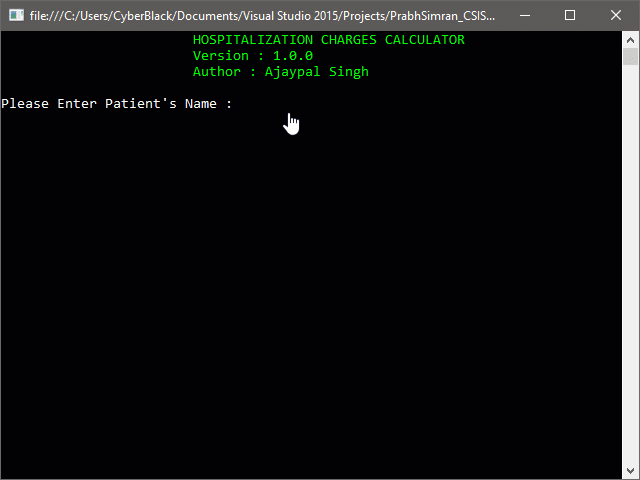

# Hospitalization Charges Application Assignment (CSIS 1175) DouGlas College

### CSIS 1175: INTRODCTION TO PROGRAMMING I

This program computes and displays various components of hospitalization cost based on the level of hospital stay, duration of stay, and costs associated with diagnostic tests, lab tests, medication and rehab, if any. You will be prompted to enter several inputs.

###Learning Objectives

- Demonstrate ability to write reusable code using void and value-returning methods
- Demonstrate ability to use variables and constants in a program, including choosing the
  appropriate data type and scope for a variable/constant.
- Demonstrate ability to use input values to perform computations.
- Ability to display formatted output in output labels.

